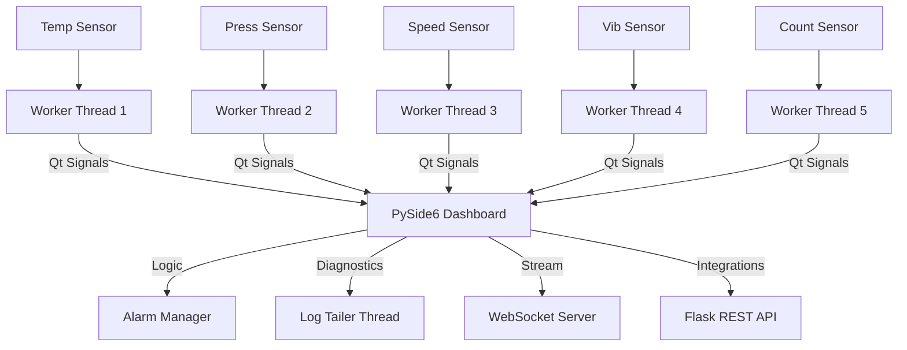

# Presentation: Industrial Sensor Dashboard
**Si-Ware Systems Product Engineer Assessment**

---

## 1. Project Overview
- **Goal**: Build a robust, real-time monitoring solution for 5 industrial sensors.
- **Key Challenges**: High-frequency updates (2Hz+), multi-source data ingestion, and thread-safe UI management.
- **Outcome**: A modular, scalable Python desktop application with integrated analytics and remote access.

---

## 2. Technical Architecture & Concurrency

- **Concurrency**: `QThread` pool handling 5 parallel TCP streams ensures zero head-of-line blocking.
- **Decoupling**: Business logic is isolated from the UI thread using a signal-slot architecture.

---

## 3. Bonus A: Remote Maintenance Console
**Full Implementation in "Maintenance" Tab:**
- **Access Control**: Securely guarded by a password gate (default: `admin`).
- **Live Log Viewer**: Real-time tailing of `app.log` via a dedicated background thread.
- **Remote Commands**: 
  - `Self-Test`: Diagnostic ping of all sensor ports.
  - `Force Refresh`: On-demand restart of the ingestion pipeline.
  - `Clear History`: Wipes local alarm logs for a fresh start.
- **Data Streaming**: Independent WebSocket server (Port 8765) for third-party telemetry.

---

## 4. Bonus B: Alarm Notification System
**Omni-channel Proactive Alerting:**
- **Local**: Instant desktop popups (via `plyer`) for on-site operators.
- **Cloud**: JSON Webhook POST notifications for SCADA or cloud ingestion.
- **Engineering**: Automated SMTP Email alerts for remote support teams.
- **Intelligence**: Integrated alarm deduplication to prevent "alert fatigue."

---

## 5. Scaling & Industrialization
- **Configuration-Driven**: Adding a 6th sensor is as simple as adding an entry to `config.py`.
- **API First**: The built-in REST API and WebSocket server allow for enterprise-wide integration.
- **Robust Error Handling**: Graceful handling of network drops and "Faulty Sensor" states with auto-reconnection.

---

## 6. Demo Highlights
- **Real-time Performance**: Smooth 2Hz updates across table, status, and plots.
- **System Stability**: Verified through an exhaustive suite of unit and integration tests.
- **UI Aesthetics**: Professional dark-themed dashboard with embedded Matplotlib trend analysis.

---

**Thank You!**
*Questions?*
